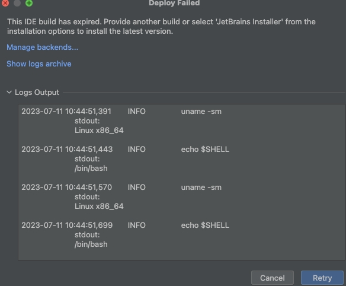
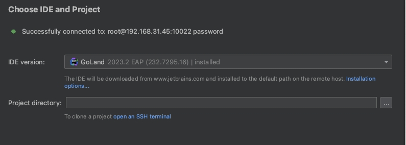

报错： `This build of IntelliJ IDEA has expired" when running`

问题表现：

参考：https://intellij-support.jetbrains.com/hc/en-us/community/posts/360004306500-Getting-This-build-of-IntelliJ-IDEA-has-expired-when-running-buildSearchableOptions-

原因是选择了EAP，换成别的release版本就可以了

